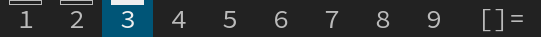
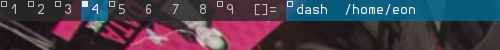
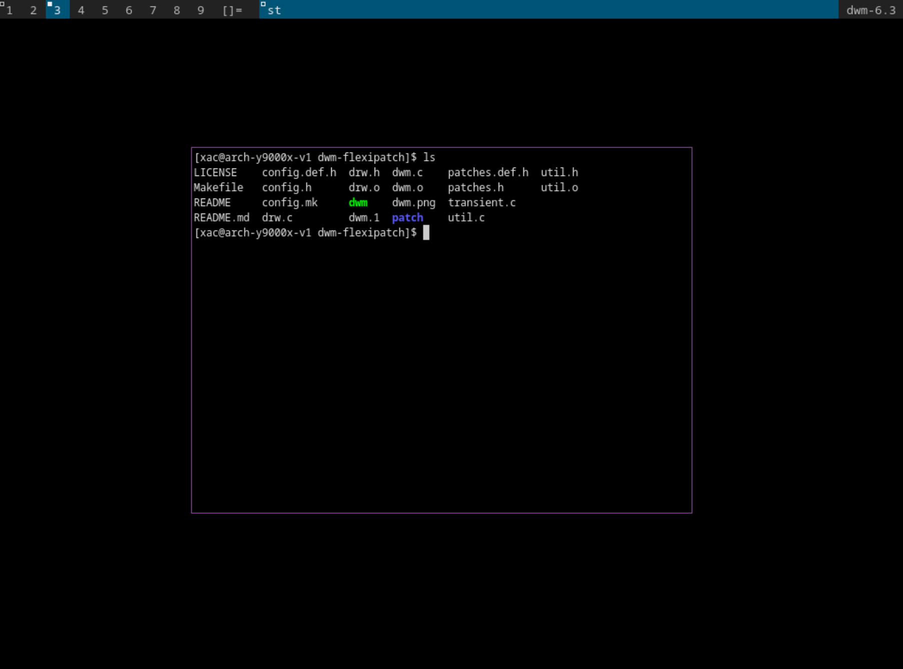
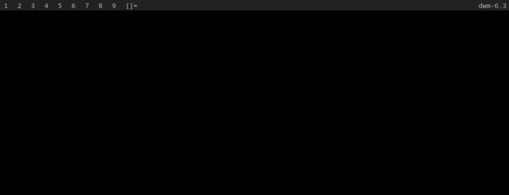
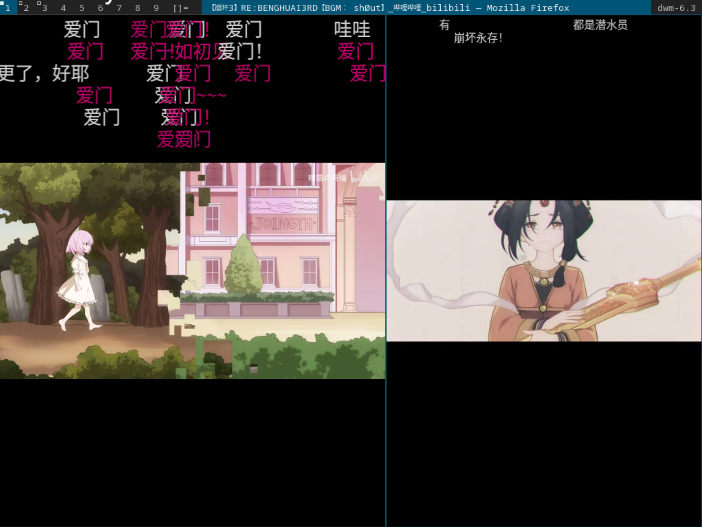
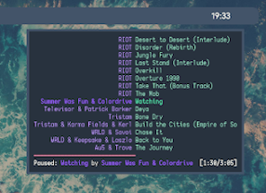

## accessnthmonitor

https://dwm.suckless.org/patches/accessnthmonitor/ 

- 功能简介

  功能如其名，到达第n个显示器，用于在多显示器环境中直接切换。

- 使用方法

  ```diff
  +        { ALTMOD,                       KEY,      focusnthmon,    {.i  = TAG } }, \
  +        { ALTMOD|ShiftMask,             KEY,      tagnthmon,      {.i  = TAG } },
  ```
  
  使用focusnthmon切换到第n个monitor，使用tagnthmon将当前focus的窗口移至第n个显示器。

## activetagindicatorbar

https://dwm.suckless.org/patches/activetagindicatorbar/

- 功能简介

    

  此补丁将指示Client是否被使用的矩形标记更改为tag数字上方的条状标记。使用时需注意tag的字体在顶部留出足够的空间。 

- 使用方法

  直接使用

## actualfullscreen

https://dwm.suckless.org/patches/actualfullscreen/

- 功能简介

  切换至真正的全屏而不是通过开关bar切换全屏（两者的区别待补充）

- 使用方法

  ```diff
  +	{ MODKEY|ShiftMask,             XK_f,      togglefullscr,  {0} },
  ```

  使用togglefullscr进入/退出全屏模式

## adjacenttag 

https://dwm.suckless.org/patches/adjacenttag/

- 功能简介

  用于快速在相邻的tag之间切换，使用`skipvacant`版本可以跳过空闲标签。

- 使用方法

  ```diff
  +	{ MODKEY,                       XK_Right,  viewnext,       {0} },
  +	{ MODKEY,                       XK_Left,   viewprev,       {0} },
  +	{ MODKEY|ShiftMask,             XK_Right,  tagtonext,      {0} },
  +	{ MODKEY|ShiftMask,             XK_Left,   tagtoprev,      {0} },
  ```

  使用viewnext切换至右边的tag，viewprev左边，使用tagtonext，将当前focus的client切换到右边的tag，tagtoprev，将当前focus的client切换到左边的tag。

## alpha 

https://dwm.suckless.org/patches/alpha/

- 功能简介

  
  
  透明的bar

- 使用方法

  直接使用

## alternativetags 

https://dwm.suckless.org/patches/alternativetags/

- 功能简介

  允许在运行过程中更改bar上各tag的标识符，不用的时候可以为设置好的图案，切换时可以换回数字更快操作，但只能设置两组进行切换。


- 使用方法

  ```diff
  @@ -20,6 +20,8 @@ static const char *colors[][3]      = {
  /* tagging */
  static const char *tags[] = { "1", "2", "3", "4", "5", "6", "7", "8", "9" };
  +static const char *tagsalt[] = { "1", "2", "3", "4", "5", "6", "7", "8", "9" };
  +static const int momentaryalttags = 0; /* 1 means alttags will show only when key is held down*/
  
  @@ -85,6 +87,7 @@ static Key keys[] = {
    { MODKEY|ShiftMask,             XK_period, tagmon,         {.i = +1 } },
  +	{ MODKEY,                       XK_n,      togglealttag,   {0} },
  ```
  
  在tagsalt和tags中设置想要切换的图标，togglealttag可以切换两组tag的图案，若将momentaryalttags设置为1，则在按住快捷键时显示切换的图案，而不是按下切换。

## alttagsdecoration

https://dwm.suckless.org/patches/alttagsdecoration/

- 功能简介

  将有client的tag标识从每个tag左上角的小矩形换为自定义图标。

- 使用方法

  ```diff
  static const char *tags[] = { "1", "2", "3", "4", "5", "6", "7", "8", "9" };
  +static const char *alttags[] = { "<01>", "<02>", "<03>", "<04>", "<05>" };
  ```

  在alttags中设置想要的图案，当该tag有client的时候，tag标识则会更改。

## alwayscenter

https://dwm.suckless.org/patches/alwayscenter/

- 功能简介

  所有floating的窗口将被居中，与`center`补丁功能类似，但不需要规则。

- 使用方法

  直接使用

## alwaysfullscreen

https://dwm.suckless.org/patches/alwaysfullscreen/

- 功能简介

  当调用focusstack函数时，focus不会从fullscreen的client上移至切换的窗口。该补丁已经被写入`67d76bdc6810`版本之后的dwm，因此仅版本靠前的dwm需要此补丁。

- 使用方法

  直接使用

## alwaysontop

https://dwm.suckless.org/patches/alwaysontop/

- 功能简介

  使选定的floating窗口用于位于最上层。

- 使用方法

  ```diff
  +	{ MODKEY|ShiftMask,             XK_space,  togglealwaysontop, {0} },
  ```

  togglealwaysontop将focus的窗口开启/关闭位于最上层。 


## anybar

https://dwm.suckless.org/patches/anybar/

- 功能简介

  将dwm的bar换为其他bar，如lemonbar或polybar。

- 使用方法

  ```diff
  @@ -5,6 +5,10 @@ static const unsigned int borderpx  = 1;        /* border pixel of windows */
  static const unsigned int snap      = 32;       /* snap pixel */
  static const int showbar            = 1;        /* 0 means no bar */
  static const int topbar             = 1;        /* 0 means bottom bar */
  +static const int usealtbar          = 1;        /* 1 means use non-dwm status bar */
  +static const char *altbarclass      = "Polybar"; /* Alternate bar class name */
  +static const char *alttrayname      = "tray";    /* Polybar tray instance name */
  +static const char *altbarcmd        = "$HOME/bar.sh"; /* Alternate bar launch command */
  static const char *fonts[]          = { "monospace:size=10" };
  static const char dmenufont[]       = "monospace:size=10";
  static const char col_gray1[]       = "#222222";
  ```

 showbar必须为1，usealtbar表示使用外部bar，altbarclass为外部bar的class name，alttrayname为外部tray的instance name，这两个参数可以通过`xprop`命令找到。altbarcmd为启动该bar的命令。

## aspectresize

https://dwm.suckless.org/patches/aspectresize/

- 功能简介

  按照固定纵横比的方式更改client的尺寸。

- 使用方法

  ```diff
  +	{ MODKEY|ShiftMask,             XK_j,      aspectresize,   {.i = +24} },
  +	{ MODKEY|ShiftMask,             XK_k,      aspectresize,   {.i = -24} },
  ```

  设置.i参数更改放大和缩小的速度。

## attachabove

https://dwm.suckless.org/patches/attachabove/

- 功能简介

  使新创建的client不位于master位置，而是当前窗口的前一个位置。

- 使用方法

  直接使用

##  attachaside

https://dwm.suckless.org/patches/attachaside/

- 功能简介

  使新创建的client不位于master位置，而是堆起来（右边）的位置。可能是当前tag中非浮动窗口的第一个窗口之后，待测试。

  ```
  原dwm： 
  +-----------------+-------+
  |                 |       |（N表示新窗口，P表示原窗口）
  |                 |   P   |
  |                 |       |
  |        N        +-------+
  |                 |       |
  |                 |       |
  |                 |       |
  +-----------------+-------+
  补丁后：
  +-----------------+-------+
  |                 |       |
  |                 |   N   |
  |                 |       |
  |        P        +-------+
  |                 |       |
  |                 |       |
  |                 |       |
  +-----------------+-------+
  +-----------------+-------+
  |                 |       |
  |                 |   P   |
  |                 |       |
  |                 +-------+
  |                 |       |
  |                 |   N   |
  |                 |       |
  +-----------------+-------+
  ```
  
- 使用方法

  直接使用

## attachasideandbelow

https://dwm.suckless.org/patches/attachasideandbelow/

- 功能简介

  以上两个patch的结合，具体功能待补充，功能应该与aside相同但是代码有改进，考虑了更多的“意外情况”。

- 使用方法

  直接使用

## attachbelow

https://dwm.suckless.org/patches/attachbelow/

- 功能简介

  使新创建的client不位于master位置，而是focus窗口的上一个位置。

- 使用方法

  ```diff
  +{ MODKEY,                       XK_Tab,           toggleAttachBelow,           {0} },
  ```
  可以通过快捷键来启用/关闭该功能。

## attachbottom

https://dwm.suckless.org/patches/attachbottom/

- 功能简介

  使新创建的client不位于master位置，而是整个tag中最后（最下）的位置。

- 使用方法

  直接使用

## attachdirection

https://dwm.suckless.org/patches/attachdirection/

- 功能简介 

  该补丁是1)attachabove，2)attachaside，3)attachbelow，4)attachbottom 和 5)attachtop的结合。可惜没有在源码中写出运行时更改attach方案的函数，实现起来也很简单。

- 使用方法

  ```diff
  +static const int attachdirection = 0;    /* 0 default, 1 above, 2 aside, 3 below, 4 bottom, 5 top */
  ```

  attachdirection设置为0，1，2，3，4，5分别表示新client将attach到默认，上，旁边，下，最底，最上。

## attachtop

https://dwm.suckless.org/patches/attachtop/

- 功能简介

  使新创建的client不位于master位置，而是master窗口的下一个位置，也就是右边最上的位置。当只有一个master时和attachaside功能相同。

- 使用方法
  
  直接使用

## autoresize

https://dwm.suckless.org/patches/autoresize/

- 功能简介

  正常无法调整不可见窗口的大小和位置，此patch使其可以被调整。（不确定：此处的不可见窗口是指其他tag中的窗口，所以意思是调整一个tag布局的时候同时也会改变其他窗口的）。

- 使用方法

  直接使用

## autostart

https://dwm.suckless.org/patches/autostart/

- 功能简介

  这个补丁将在dwm进入主循环运行之前运行`~/.dwm/autostart_blocking.sh`和`~/.dwm/autostart.sh &`，然后才启动dwm。可以省略其中一个或两个文件。
  上面列出的文件分别在目录`$XDG_DATA_HOME/DWM`、`$HOME/.local/Share/DWM`和`$HOME/.dwm`中查找。将会在最先找到的目录中运行脚本，即使该目录下没有脚本。

- 使用方法

  直接使用，将脚本文件放入`~/.dwm`下，同时确保没有上面提到的另两个目录。同时注意若`~/.dwm/autostart_blocking.sh`无法执行完毕，则将卡死。

## awesomebar

https://dwm.suckless.org/patches/awesomebar/

- 功能简介

  - 将在bar上显示tag中所有的client名称，而不只是focus的那个
  - 点击bar上的client名称可以切换focus
  - 点击focus的client名称可以隐藏该client
  - 点击隐藏的client名称会将其取消隐藏并切换至focus
  - 可以快捷键访问循环访问非隐藏窗口或全部窗口

- 使用方法

  ```diff
    { MODKEY,                       XK_b,      togglebar,      {0} },
  -	{ MODKEY,                       XK_j,      focusstack,     {.i = +1 } },
  -	{ MODKEY,                       XK_k,      focusstack,     {.i = -1 } },
  +	{ MODKEY,                       XK_j,      focusstackvis,  {.i = +1 } },
  +	{ MODKEY,                       XK_k,      focusstackvis,  {.i = -1 } },
  +	{ MODKEY|ShiftMask,             XK_j,      focusstackhid,  {.i = +1 } },
  +	{ MODKEY|ShiftMask,             XK_k,      focusstackhid,  {.i = -1 } },
    { MODKEY,                       XK_i,      incnmaster,     {.i = +1 } },
  +	{ MODKEY,                       XK_s,      show,           {0} },
  +	{ MODKEY,                       XK_h,      hide,           {0} },
   ```

  MODKEY+j和MODKEY+k现在用于循环访问非隐藏窗口，MODKEY+SHIFT可以循环访问所有窗口，包括隐藏窗口。MODKEY+h和s用于隐藏和显示当前focus的窗口。
   
  在打补丁时我发现可能因为该patch基于较为古老的dwm所写，新的dwm中focusstack的代码进行了改进

  因此对于diff文件中的
  ```diff
  +void
  +focusstack(int inc, int hid)
  {
 	Client *c = NULL, *i;
 
  -	if (!selmon->sel) // dwm6.3源码中已经删除了该行
  +	if (!selmon->sel && !hid)
 		return;
  ```
  这部分的代码应该改为
  ```diff
  Client *c = NULL, *i;
   
  - if (!selmon->sel || (selmon->sel->isfullscreen && lockfullscreen)) // dwm6.3
  + if ((!selmon->sel && !hid) || (selmon->sel && selmon->sel->isfullscreen && lockfullscreen))
   	return;
  ```
  同时我还编写了一个函数用于使当前tag中所有窗口全部取消隐藏的函数。也可将其加入dwm.c并在config.h中为其设置快捷键。
  ```c
  // dwm.c
  void
  showall(const Arg *arg)
  {
    Client *c = NULL;
    selmon->hidsel = 0;
    for (c = selmon->clients; c ; c = c->next) {
      if (ISVISIBLE(c)) // the client in current tag
        showwin(c);
    }
    if (!selmon->sel) { // if no focus, select one to focus
      for (c = selmon->clients; c && !ISVISIBLE(c); c = c->next);
      if (c)
        focus(c);
    }
    restack(selmon);
  }
  // config.h
  { MODKEY|ShiftMask,             XK_s,      showall,        {0} },
  ```
  
  Update: 现在可以在我的仓库里找的适配6.3版本的patch，相关文件已提交dwm wiki

## azerty

https://dwm.suckless.org/patches/azerty/

- 功能简介

  将原快捷键布局改为符合azerty键盘布局的快捷键键位。

- 使用方法

  直接使用

## bar height

https://dwm.suckless.org/patches/bar_height/

- 功能简介

  更改bar的高度

- 使用方法

  ```diff
  +static const int user_bh            = 0;        /* 0 means that dwm will calculate bar height, >= 1 means dwm will user_bh as bar height */
  ```
 更改user_bh，0表示和之前一样，大于等于1表示按照user_bh作为bar的高度。

## barconfig

https://dwm.suckless.org/patches/barconfig/

- 功能简介

  自定义bar上各标签的位置

- 使用方法

  ```diff
  +static const char *barlayout        = "tln|s";
  ```
  `l`：布局指示，即`[]=`，`[M]`等

  `n`：窗口名称

  `s`：状态栏，用`xsetroot`设置的

  `t`：标签指示，即1-9

  `|`：分隔符，该分隔符左边的左对齐，右边的靠右对齐

## barpadding

https://dwm.suckless.org/patches/barpadding/

- 功能简介

  使bar的水平和垂直方向有间隙，而不是紧贴屏幕边缘。

- 使用方法

  ```diff
  +static const int vertpad            = 10;       /* vertical padding of bar */
  +static const int sidepad            = 10;       /* horizontal padding of bar */
  ```
  vertpad表示垂直方向，sidepad表示水平方向。

## bartabgroups

https://dwm.suckless.org/patches/bartabgroups/

- 功能简介

  在tile模式下将bar上各client的标题按照左右分割进行展示，在float和monocle模式下只展示一个标题。对于用户自定义模式，如grid模式表现和tile类似。还增加了一个指示符用于指示该client在那些tag上出现。还可以更改tag指示的排列，如改为3x3的网格形式，不是1x9平铺。

- 使用方法

  ```diff
  @@ -16,6 +16,8 @@ static const char *colors[][3]      = {
 	/*               fg         bg         border   */
 	[SchemeNorm] = { col_gray3, col_gray1, col_gray2 },
 	[SchemeSel]  = { col_gray4, col_cyan,  col_cyan  },
  +	[SchemeTabActive]  = { col_gray2, col_gray3,  col_gray2 },
  +	[SchemeTabInactive]  = { col_gray1, col_gray3,  col_gray1 }
  };
  
  /* tagging */
  @@ -37,6 +39,15 @@ static const int nmaster     = 1;    /* number of clients in master area */
  static const int resizehints = 1;    /* 1 means respect size hints in tiled resizals */
  static const int lockfullscreen = 1; /* 1 will force focus on the fullscreen window */
  
  +/* Bartabgroups properties */
  +#define BARTAB_BORDERS 1       // 0 = off, 1 = on
  +#define BARTAB_BOTTOMBORDER 1  // 0 = off, 1 = on
  +#define BARTAB_TAGSINDICATOR 1 // 0 = off, 1 = on if >1 client/view tag, 2 = always on
  +#define BARTAB_TAGSPX 5        // 指示tag的小格子的像素大小
  +#define BARTAB_TAGSROWS 3      // 指示tag的小格子排多少行
  +static void (*bartabmonfns[])(Monitor *) = { monocle /* , 与monocle类似的自定义layout */ };
  +static void (*bartabfloatfns[])(Monitor *) = { NULL /* , 与float类似的自定义layout */ };
  ```
  更改以上这些定义的值可以调整该patch的效果，未设置的自定义layout应该表现都和tile类似。

## bidi(Bidirectional Text)

https://dwm.suckless.org/patches/bidi/

- 功能简介

  添加了对从右向左书写语言的支持

- 使用方法

  直接使用

## blanktags

- 功能简介
 
  将tag指示变为小方块，取消了1-9的数字指示，并且不显示没有client的tag（虽然不显示，但依然占位）

- 使用方法

  直接使用

## bottomstack

https://dwm.suckless.org/patches/bottomstack/

- 功能简介

  增加两种布局，让新client出现在master的下面。

  ```
  bstack        (TTT)       bstackhoriz   (===)
  +-----------------+       +-----------------+
  |                 |       |                 |
  |                 |       |                 |
  |                 |       |                 |
  +-----+-----+-----+       +-----------------+
  |     |     |     |       +-----------------+
  |     |     |     |       +-----------------+
  +-----+-----+-----+       +-----------------+
  ```

- 使用方法

  bstack [Alt]+[u], bstackhoriz [Alt]+[o]。

## canfocusfloating

https://dwm.suckless.org/patches/canfocusfloating/

- 功能简介

  可选择是否focus到floating client上，如开启则所有floating client将被跳过（MODKEY+j/k）无法focus。

- 使用方法

  ```diff
  +  { MODKEY,                       XK_s,      togglecanfocusfloating,   {0} },
  ```
  使用togglecanfocusfloating开启/关闭该功能。

## canfocusrule

https://dwm.suckless.org/patches/canfocusrule/

- 功能简介

  为某窗口设置rule使其永远无法被focus，对tray可能一类的软件可能很实用。

- 使用方法

  ```diff
  @@ -26,9 +26,9 @@ static const Rule rules[] = {
 	 *	WM_CLASS(STRING) = instance, class
 	 *	WM_NAME(STRING) = title
 	 */
  -	/* class      instance    title       tags mask     isfloating   monitor */
  -	{ "Gimp",     NULL,       NULL,       0,            1,           -1 },
  -	{ "Firefox",  NULL,       NULL,       1 << 8,       0,           -1 },
  +	/* class      instance    title       tags mask     isfloating canfocus   monitor */
  +	{ "Gimp",     NULL,       NULL,       0,            1,         1,         -1 },
  +	{ "Firefox",  NULL,       NULL,       1 << 8,       0,         1,         -1 },
  };
  ```
  更改rule数组，canfocus为0表示不可focus。

## center

https://dwm.suckless.org/patches/center/

- 功能简介

  为某窗口设置rule使其永远居中。

- 使用方法

  ```diff
  @@ -26,9 +26,9 @@ static const Rule rules[] = {
  *	WM_CLASS(STRING) = instance, class
  *	WM_NAME(STRING) = title
  */
  -	/* class      instance    title       tags mask     isfloating   monitor */
  -	{ "Gimp",     NULL,       NULL,       0,            1,           -1 },
  -	{ "Firefox",  NULL,       NULL,       1 << 8,       0,           -1 },
  +	/* class      instance    title       tags mask     iscentered   isfloating   monitor */
  +	{ "Gimp",     NULL,       NULL,       0,            0,           1,           -1 },
  +	{ "Firefox",  NULL,       NULL,       1 << 8,       0,           0,           -1 },
  };
  ```
  更改rule数组，在iscentered的位置给1表示居中。

## center first window

https://dwm.suckless.org/patches/center_first_window/

- 功能简介

  若整个tag内只有一个client则将其center，可通过rule设置哪个窗口被center。
  ```
  +-----------------------------+         +-----------------------------+
  |                             |         | +------------+ +----------+ |
  |                             |         | |            | |          | |
  |                             |         | |            | |          | |
  |       +-------------+       |         | |            | |          | |
  |       |    Single   |       |         | |  Terminal  | | Terminal | |
  |       |   Terminal  |       |         | |  Window 1  | | Window 2 | |
  |       |    Window   |       |         | |            | |          | |
  |       +-------------+       |         | |            | |          | |
  |                             |         | |            | |          | |
  |                             |         | |            | |          | |
  |                             |         | +------------+ +----------+ |
  +-----------------------------+         +-----------------------------+
  ```
  适用于很大的屏幕，一个terminal可能需要看到屏幕的左上角很不方便。

- 使用方法

  ```diff
  @@ -26,9 +26,10 @@ static const Rule rules[] = {
 	 *	WM_CLASS(STRING) = instance, class
 	 *	WM_NAME(STRING) = title
 	 */
  -	/* class      instance    title       tags mask     isfloating   monitor */
  -	{ "Gimp",     NULL,       NULL,       0,            1,           -1 },
  -	{ "Firefox",  NULL,       NULL,       1 << 8,       0,           -1 },
  +	/* class      	     instance    title    tags mask     isfloating   CenterThisWindow?     monitor */
  +	{ "st",              NULL,       NULL,    0,            0,     	     1,		           -1 },
  +	{ "Gimp",            NULL,       NULL,    0,            1,           0,                    -1 },
  +	{ "Firefox",         NULL,       NULL,    1 << 8,       0,           0,                    -1 },
  };
  ```
  更改rule数组，CenterThisWindow表示该client启用此patch的功能。

## centeredmaster

https://dwm.suckless.org/patches/centeredmaster/

- 功能简介

  增加了两种布局centeredmaster，centeredfloatingmaster。效果如下
  ```
  centeredmaster
  +------------------------------+       +------------------------------+
  |+--------++--------++--------+|       |+--------++--------++--------+|
  ||        ||        ||        ||       ||        ||        ||        ||
  ||        ||        ||        ||       ||        ||   M1   ||        ||
  ||        ||        ||        ||       ||        ||        ||        ||
  ||  S2    ||   M    ||   S1   ||       ||        |+--------+|        ||
  ||        ||        ||        ||       ||        |+--------+|        ||
  ||        ||        ||        ||       ||        ||        ||        ||
  ||        ||        ||        ||       ||        ||   M2   ||        ||
  ||        ||        ||        ||       ||        ||        ||        ||
  |+--------++--------++--------+|       |+--------++--------++--------+|
  +------------------------------+       +------------------------------+
  centeredfloatingmaster（仅master窗口浮动在中央）
  +------------------------------+       +------------------------------+
  |+--------++--------++--------+|       |+--------++--------++--------+|
  ||        ||        ||        ||       ||        ||        ||        ||
  ||    +------------------+    ||       ||    +--------++--------+    ||
  ||    |                  |    ||       ||    |        ||        |    ||
  ||    |                  |    ||       ||    |        ||        |    ||
  ||    |        M         |    ||       ||    |   M1   ||   M2   |    ||
  ||    |                  |    ||       ||    |        ||        |    ||
  ||    +------------------+    ||       ||    +--------++--------+    ||
  ||        ||        ||        ||       ||        ||        ||        ||
  |+--------++--------++--------+|       |+--------++--------++--------+|
  +------------------------------+       +------------------------------+
  ```
  
- 使用方法

  ```diff
  @@ -39,6 +39,8 @@ static const Layout layouts[] = {
 	{ "[]=",      tile },    /* first entry is default */
 	{ "><>",      NULL },    /* no layout function means floating behavior */
 	{ "[M]",      monocle },
  +	{ "|M|",      centeredmaster },
  +	{ ">M>",      centeredfloatingmaster },
  };

  +	{ MODKEY,                       XK_u,      setlayout,      {.v = &layouts[3]} },
  +	{ MODKEY,                       XK_o,      setlayout,      {.v = &layouts[4]} },
  ```
  通过快捷键切换布局。
  
## centeredwindowname

https://dwm.suckless.org/patches/centeredwindowname/

- 功能介绍

  将client的名称居中显示而不是靠在显示在bar上。

- 使用方法

  直接使用

## centertitle

https://dwm.suckless.org/patches/centretitle/

- 功能介绍

  将client的名称居中显示而不是靠在显示在bar上。与上面的补丁功能类似，区别不明，未测试。

- 使用方法

  直接使用

## cfacts

https://dwm.suckless.org/patches/cfacts/

- 功能介绍

  可以调整client的高度（默认只能左右）
  ```
  +---------------------+
  |          |   0.5    |
  |   1.0    +----------+
  +----------+          |
  |          |   1.0    |
  |          +----------+
  |   2.0    |          |
  |          |   1.0    |
  +----------+----------+
  ```

  还提供了三种基于cfacts的layout。bottomstack，centeredmaster和deck。

- 使用方法

  ```diff
  +	{ MODKEY|ShiftMask,             XK_h,      setcfact,       {.f = +0.25} },
  +	{ MODKEY|ShiftMask,             XK_l,      setcfact,       {.f = -0.25} },
  +	{ MODKEY|ShiftMask,             XK_o,      setcfact,       {.f =  0.00} },
  ```
  从上到下依次是变高，变低，复原。

## clientindicators

https://dwm.suckless.org/patches/clientindicators/

- 功能简介

  原始的dwm只有小矩形指示该tag是否有client，该patch可以显示client的数量。

  dwm-clientindicators-6.2.diff 为该补丁

  dwm-clientindicatorshidevacant-6.2.diff 为该补丁+hidevacant补丁

- 使用方法

  直接使用
  
## clientmonoclesymbol

https://dwm.suckless.org/patches/clientmonoclesymbol/

- 功能简介

  将monocle layout的client数量指示标改为自定义的图标，即`[1]`，`[2]`之类的可自定义。

- 使用方法

  ```diff
  +/* 当clients数量大于设置的图标数量时，使用最后一个 */
  +static const char *monocles[] = { "[1]", "[2]", "[3]", "[4]", "[5]", "[6]", "[7]", "[8]", "[9]", "[9+]" };
  ```
  设置monocles数组以改变图标。

## clientopacity

https://dwm.suckless.org/patches/clientopacity/

- 功能简介

  可以更改client的透明度。

- 使用方法

  ```diff
  +static const double defaultopacity  = 0.75; // 默认透明度

  @@ -26,9 +27,10 @@ static const Rule rules[] = {
 	*	WM_CLASS(STRING) = instance, class
 	*	WM_NAME(STRING) = title
 	*/
  -	/* class      instance    title       tags mask     isfloating   monitor */
  -	{ "Gimp",     NULL,       NULL,       0,            1,           -1 },
  -	{ "Firefox",  NULL,       NULL,       1 << 8,       0,           -1 },
  +	/* class      instance    title       tags mask     isfloating	 opacity	monitor */
  +	{ "Gimp",     NULL,       NULL,       0,            1,           1.0,		-1 },
  +	{ "Firefox",  NULL,       NULL,       1 << 8,       0,           1.0,		-1 },
  +	{ "St",	      NULL,       NULL,       0,            0,           defaultopacity, -1},

  +	{ MODKEY|ShiftMask,		XK_KP_Add, changeopacity,	{.f = +0.1}},
  +	{ MODKEY|ShiftMask,		XK_KP_Subtract, changeopacity,  {.f = -0.1}},
  ```
  defaultopacity为默认透明度，可以通过rule给窗口单独设置透明度，通过快捷键也可调整focus窗口的透明度。

## clients per tag

https://dwm.suckless.org/patches/clientspertag/

- 功能简介

  可以设置一个tag中最多可以看见的client数量，多余的会和monocle一样被压在下面，也可理解为monocle布局，但是一层可以有多个client。（该patch最新版本时2009年的，不知是否还可使用）

  ```
  +-----------------------+  +-----------------------+
  | -1/3                  |  |  2/3                  |
  +-----------+-----------+  +-----------+-----------+
  |           |           |  |           |           |
  |           |     2     |  |           |           |
  |           |           |  |           |           |
  |     1     +-----------+  |     1     |     2     |
  |           |           |  |           |           |
  |           |     3     |  |           |           |
  |           |           |  |           |           |
  +-----------+-----------+  +-----------+-----------+
            cpt=-1                     cpt=2
  ```

- 使用方法

  ```diff
  +static int cpt = -1; //-1显示所有client，0只显示floating client，其他为显示个数

  static Key keys[] = {
	/* modifier      key        function        argument */
	...
	+ { MODKEY,        XK_q,      clientspertag,  {.v="2"} },
	+ { MODKEY,        XK_a,      clientspertag,  {.v="^3"} },
  };
  ```
  .v=2表示给cpt赋值为2，^3表示将cpt的值在3和-1之间切换，即按一次cpt为3，再按一次就切换回-1。

## cmdcustomize(customise dwm through command line)

https://dwm.suckless.org/patches/cmdcustomize/

- 功能简介

  dwm默认只能从config.h中设置主题颜色，每次设置完需要重新编译，该补丁可以在启动dwm时使用命令行参数设置颜色。

- 使用方法

  - fn：dwm字体
  - df：dmenu字体
  - nb：普通背景颜色
  - nf：普通前景颜色
  - sb：选中背景颜色 
  - sf：选中前景颜色
  - dnb：dmenu普通背景颜色 
  - dnf：dmenu普通前景颜色
  - dsb：dmenu选中背景颜色
  - dsf：dmenu选中前景颜色

## colemak_keys

https://dwm.suckless.org/patches/colemak_keys/

- 功能简介

  将原快捷键布局改为符合colemak键盘布局的快捷键键位。

- 使用方法
  
  直接使用

## colorbar

https://dwm.suckless.org/patches/colorbar/

- 功能简介

  可以自定义bar的各部件的颜色。

- 使用方法

  ```diff
  [SchemeSel]  = { col_gray4, col_cyan,  col_cyan  },
  +	[SchemeStatus]  = { col_gray3, col_gray1,  "#000000"  }, // Statusbar right {文本，背景，未使用但不能为空}
  +	[SchemeTagsSel]  = { col_gray4, col_cyan,  "#000000"  }, // Tagbar left 选中 {文本，背景，未使用但不能为空}
  +    [SchemeTagsNorm]  = { col_gray3, col_gray1,  "#000000"  }, // Tagbar left 未选中 {文本，背景，未使用但不能为空}
  +    [SchemeInfoSel]  = { col_gray4, col_cyan,  "#000000"  }, // infobar middle  选中 {文本，背景，未使用但不能为空}
  +    [SchemeInfoNorm]  = { col_gray3, col_gray1,  "#000000"  }, // infobar middle  未选中 {文本，背景，未使用但不能为空}
  ```

## columngaps

https://dwm.suckless.org/patches/columngaps/

- 功能简介

  该补丁为column layout添加了间隙吗，如同tilegaps给tile布局添加间隙一样。该补丁内置column layout。

- 使用方法

  ```diff
  +static const unsigned int gappx     = 12;       /* 间隙的大小 */
  +	{ MODKEY,                       XK_c,      setlayout,      {.v = &layouts[3]} },
  ```
  提供快捷键切换至column layout。

## columns

https://dwm.suckless.org/patches/columns/

- 功能简介

  提供column layout。将整个tag内的布局按列平均排布，始终有nmater+1列，最后一列与tile布局类似，是叠起来的布局。可以理解为将tile布局的master位置按列又拆了几块。

- 使用方法

  与columngaps相同，只是没有client之间的gap。

## combo

https://dwm.suckless.org/patches/combo/

- 功能简介

  提供“按住”而不是切换的方式同时查看多个tag，dwm默认操作是MODKEY+CTRL+(1-9)同时查看选中的tag，再按一次可以取消对某tag的选中。

- 使用方法

  按住MODKEY并同时按住1、3可以同时查看1、3tag中的内容。

## cool autostart

https://dwm.suckless.org/patches/cool_autostart/

- 功能简介

  使dwm执行一些命令，并在退出dwm之后关闭由该该命令所产生的所有进程。（可以用其打开vpn之类的软件）

- 使用方法

  ```diff
  +static const char *const autostart[] = {
  +	"st", NULL,
  +	NULL /* terminate */
  +};
  +
  ```
  在autostart数组中写入需要执行的命令，每条命令以NULL结尾，所有命令之后也以NULL结尾。

## cropwindows

https://dwm.suckless.org/patches/cropwindows/

- 功能简介

  创建现有窗口的裁剪视图，只显示其中的一部分，通常是为了从框架不好的视频或程序和设计糟糕的网站中回收屏幕空间。

- 使用方法

  ```diff
  +{ ClkClientWin, MODKEY|ShiftMask, Button1, movemouse,   {.i = 1} },
  +{ ClkClientWin, MODKEY|ShiftMask, Button3, resizemouse, {.i = 1} },
  ```
  MODKEY+SHIFT+鼠标左键可以创建一个裁剪窗口，MODKEY+SHIFT+鼠标右键可以移动该窗口里的内容。

## current_desktop

https://dwm.suckless.org/patches/current_desktop/

- 功能简介

  将root上的_NET_NUMBER_OF_DESKTOPS和_NET_CURRENT_DESKTOP设置为适当的值。请注意，这些值的“适当”作为`xprop -root`输出没有意义，因为dwm按位使用它们，但xprop以十进制显示它们。如果您选择了桌面1和3，则值为0b1010，但xprop将其显示为10。作者提到他有一个脚本使用了该特性，我理解这样可以同时将多个桌面（DESKTOP）作为一个桌面进行处理。

- 使用方法

  直接使用

## cursorwarp

https://dwm.suckless.org/patches/cursorwarp/

- 功能简介

  使切换focus或monitor的时候将鼠标移至屏幕中间。

- 使用方法

  直接使用

  dwm-cursorwarp-20210222-61bb8b2.diff为默认版本。

  dwm-cursorwarp-mononly-20210222-61bb8b2.diff仅在更换显示器时移动鼠标。

  dwm-cursorwarp-stackonly-20210222-61bb8b2.diff仅在切换focus窗口时。

## cyclelayouts

https://dwm.suckless.org/patches/cyclelayouts/

- 功能简介

  提供快捷键循环窗口layout，dwm默认只可以在两个layout之间来回换。

- 使用方法

  ```diff
  @@ -41,6 +41,7 @@ static const Layout layouts[] = {
 	{ "[]=",      tile },    /* first entry is default */
 	{ "><>",      NULL },    /* no layout function means floating behavior */
 	{ "[M]",      monocle },
  +	{ NULL,       NULL },
  };

  +	{ MODKEY|ControlMask,		XK_comma,  cyclelayout,    {.i = -1 } },
  +	{ MODKEY|ControlMask,   XK_period, cyclelayout,    {.i = +1 } },
  ```
  最后一个布局需要设置为NULL, NULL，使用提供的快捷键可以在布局之间循环。

## deck

https://dwm.suckless.org/patches/deck/

- 功能简介

  提供deck布局，可以将tile右边叠起来的那部分按照monocle的布局排列，即z轴的叠加。

  ```
  Tile :
  +-----------------+--------+
  |                 |        |
  |                 |  S1    |
  |                 |        |
  |        M        +--------+
  |                 |        |
  |                 |   S2   |
  |                 |        |
  +-----------------+--------+
  Deck :
  +-----------------+--------+
  |                 |        |
  |                 |        |
  |                 |        |
  |        M        |   S1   |
  |                 |        |
  |                 |        |
  |                 |        |
  +-----------------+--------+
  ```

- 使用方法

  直接使用

## decoration hints

https://dwm.suckless.org/patches/decoration_hints/

- 功能简介
  > 让dwm尊重_MOTIF_WM_HINTS属性，不要在请求它的窗口周围画边框。一些应用程序使用此属性通知窗口管理器不要绘制窗口装饰。
  >
  > 不尊重这个属性会导致应用程序绘制自己的边界，如chromium(关闭“使用系统标题栏和边界”选项)或vlc在全屏模式下的问题。

  我理解就是有些应用会自己绘制自己的边界，而dwm默认不让应用自己画，而是采用dwm统一的画法。

- 使用方法

  直接使用

## default tag applications

https://dwm.suckless.org/patches/default_tag_apps/

- 功能简介

  提供快捷键一键开启你设定好的所有窗口，我的理解是可以和rule一起用一键展开自己的workspace那种功能。

- 使用方法

  ```diff
  +static const char *defaulttagapps[] = { "st", NULL, NULL, NULL, NULL, NULL, NULL, NULL, NULL };

  +	{ MODKEY,                       XK_s,      spawndefault,   {0} },
  ```
  defaulttagapps是命令行中打开该软件的命令，默认快捷键为MODKEY+s。

## defaultlayoutpermonitor

https://dwm.suckless.org/patches/defaultlayoutpermonitor/

- 功能简介

  为每个monitor设置默认布局，每次打开dwm都是该布局。

- 使用方法

  ```diff
  +static const int lpm[] = {
  +        /* layouts数组的排列，默认0表示tile
  +         * 1 表示float， 如果没有为每个monitor设置一个默认layout
  +         * 则给之后的monitor设置为默认layout */
  +        0, 1
  +};
  ```

## defaulttransparency

https://dwm.suckless.org/patches/defaulttransparency/

- 功能简介

  提供快捷键调整当前focus窗口的透明度。基于Stefan Mark的`transparency` patch。

- 使用方法

  ```diff
  +static const double defaultopacity  = 0.75;

  +	{ MODKEY|ShiftMask,		XK_s,	   spawn,	   SHCMD("transset-df -a --dec .1") },
  +	{ MODKEY|ShiftMask,		XK_d,	   spawn,	   SHCMD("transset-df -a --inc .1") },
  +	{ MODKEY|ShiftMask,		XK_f,	   spawn,	   SHCMD("transset-df -a .75") },
 	{ MODKEY,                       XK_b,      togglebar,      {0} },
  ```

  defaultopacity为默认透明度，MODKEY+SHIFT+s降低透明度，d提高，f回到默认，这里的默认和defaultopacity设置的可以不相同。

## destroyfocus 

https://dwm.suckless.org/patches/destroyfocus/

- 功能简介

  每次关闭窗口时聚焦到哪个窗口是一个问题，该补丁将聚焦到鼠标所在的窗口。dwm默认应该时聚焦到被关闭窗口的上一个窗口。

- 使用方法

  直接使用

## dmenumatchtop

https://dwm.suckless.org/patches/dmenumatchtop/

- 功能简介

  使dmenu出现的位置和topbar的位置符合，如果topbar在下面，则dmenu也在下面。

- 使用方法

  直接使用

## doublepressquit

https://dwm.suckless.org/patches/doublepressquit/

- 功能简介

  需要连续按两次退出快捷键才会退出dwm，以防按错了有数据没有保存。

- 使用方法

  直接使用

## dragmfact

https://dwm.suckless.org/patches/dragmfact/

- 功能简介

  可以用鼠标调整tile布局中屏幕左右分的比例。

- 使用方法

  按住MODKEY的同时拖动分割线即可。

## dualstatus

https://dwm.suckless.org/patches/dualstatus/

- 功能简介

  提供第二条bar，可以与原有的bar一起控制是否显示也可以分开控制。

- 使用方法

  可以通过`xsetroot -name "top text;bottom text"`命令去改变第二条bar的内容。

  ```diff
  +static const int extrabar           = 1;        /* 0 means no extra bar */ 

  +	{ MODKEY,                       XK_b,      toggleextrabar, {0} },
  ```

  extrabar为1表示显示这条bar，如果将toggleextrabar的快捷键与tooglebar的设置相同就可以同时控制两条bar的出现与消失，也可单独设置快捷键。

## dwmfifo

https://dwm.suckless.org/patches/dwmfifo/

- 功能简介

  该补丁可以通过FIFO给dwm传指令，也就是可以通过命令行模拟dwm中的各个快捷键。可以用来自动化操作dwm。

- 使用方法

  通过向`/tmp/dwm.fifo`写入指令操控dwm，如
  ```bash
  $ echo toggleview1 # 打开tag1
  $ sleep 0.5
  $ echo term > /tmp/dwm.fifo # 打开terminal
  $ sleep 0.5
  $ echo toggleview2 # 打开tag2
  $ sleep 0.5
  $ echo term > /tmp/dwm.fifo # 打开terminal
  $ sleep 0.5
  ```
  可以在`config.h`中查看并更改各命令。
  ```diff
  +static const char *dwmfifo = "/tmp/dwm.fifo";
  +static Command commands[] = {
  +	{ "dmenu",           spawn,          {.v = dmenucmd} },
  +	{ "term",            spawn,          {.v = termcmd} },
  +	{ "quit",            quit,           {0} },
  +	{ "togglebar",       togglebar,      {0} },
  +	{ "focusstack+",     focusstack,     {.i = +1} },
  +	{ "focusstack-",     focusstack,     {.i = -1} },
  +	{ "incnmaster+",     incnmaster,     {.i = +1} },
  +	{ "incnmaster-",     incnmaster,     {.i = -1} },
  +	{ "setmfact+",       setmfact,       {.f = +0.05} },
  +	{ "setmfact-",       setmfact,       {.f = -0.05} },
  +	{ "zoom",            zoom,           {0} },
  +	{ "view",            view,           {0} },
  +	{ "killclient",      killclient,     {0} },
  +	{ "setlayout-tiled", setlayout,      {.v = &layouts[0]} },
  +	{ "setlayout-float", setlayout,      {.v = &layouts[1]} },
  +	{ "setlayout-mono",  setlayout,      {.v = &layouts[2]} },
  +	{ "togglelayout",    setlayout,      {0} },
  +	{ "togglefloating",  togglefloating, {0} },
  +	{ "viewall",         view,           {.ui = ~0} },
  +	{ "tag",             tag,            {.ui = ~0} },
  +	{ "focusmon+",       focusmon,       {.i = +1} },
  +	{ "focusmon-",       focusmon,       {.i = -1} },
  +	{ "tagmon+",         tagmon,         {.i = +1} },
  +	{ "tagmon-",         tagmon,         {.i = -1} },
  +	{ "view1",           view,           {.ui = 1 << 0} },
  +	{ "view2",           view,           {.ui = 1 << 1} },
  +	{ "view3",           view,           {.ui = 1 << 2} },
  +	{ "view4",           view,           {.ui = 1 << 3} },
  +	{ "view5",           view,           {.ui = 1 << 4} },
  +	{ "view6",           view,           {.ui = 1 << 5} },
  +	{ "view7",           view,           {.ui = 1 << 6} },
  +	{ "view8",           view,           {.ui = 1 << 7} },
  +	{ "view9",           view,           {.ui = 1 << 8} },
  +	{ "toggleview1",     toggleview,     {.ui = 1 << 0} },
  +	{ "toggleview2",     toggleview,     {.ui = 1 << 1} },
  +	{ "toggleview3",     toggleview,     {.ui = 1 << 2} },
  +	{ "toggleview4",     toggleview,     {.ui = 1 << 3} },
  +	{ "toggleview5",     toggleview,     {.ui = 1 << 4} },
  +	{ "toggleview6",     toggleview,     {.ui = 1 << 5} },
  +	{ "toggleview7",     toggleview,     {.ui = 1 << 6} },
  +	{ "toggleview8",     toggleview,     {.ui = 1 << 7} },
  +	{ "toggleview9",     toggleview,     {.ui = 1 << 8} },
  +	{ "tag1",            tag,            {.ui = 1 << 0} },
  +	{ "tag2",            tag,            {.ui = 1 << 1} },
  +	{ "tag3",            tag,            {.ui = 1 << 2} },
  +	{ "tag4",            tag,            {.ui = 1 << 3} },
  +	{ "tag5",            tag,            {.ui = 1 << 4} },
  +	{ "tag6",            tag,            {.ui = 1 << 5} },
  +	{ "tag7",            tag,            {.ui = 1 << 6} },
  +	{ "tag8",            tag,            {.ui = 1 << 7} },
  +	{ "tag9",            tag,            {.ui = 1 << 8} },
  +	{ "toggletag1",      toggletag,      {.ui = 1 << 0} },
  +	{ "toggletag2",      toggletag,      {.ui = 1 << 1} },
  +	{ "toggletag3",      toggletag,      {.ui = 1 << 2} },
  +	{ "toggletag4",      toggletag,      {.ui = 1 << 3} },
  +	{ "toggletag5",      toggletag,      {.ui = 1 << 4} },
  +	{ "toggletag6",      toggletag,      {.ui = 1 << 5} },
  +	{ "toggletag7",      toggletag,      {.ui = 1 << 6} },
  +	{ "toggletag8",      toggletag,      {.ui = 1 << 7} },
  +	{ "toggletag9",      toggletag,      {.ui = 1 << 8} },
  +};
  ```

## dynamicscratchpads

https://dwm.suckless.org/patches/dynamicscratchpads/

- 功能简介

  scratchpad可以理解为一个不属于任何tag的window，你可以在任何一个tag将其呼出，以float的形式存在，该补丁提供一个scratchpad，你可以将选中的window移至或移出scratchpad。也可以添加rule默认从scratchpad启动。若多个client在scratchpad中，它们将被轮询显示而不是同时。

  

- 使用方法

  ```diff
  +	{ MODKEY,                       XK_minus, scratchpad_show, {0} },
  +	{ MODKEY|ShiftMask,             XK_minus, scratchpad_hide, {0} },
  +	{ MODKEY,                       XK_equal,scratchpad_remove,{0} },
  ```
  
## dynamicswallow(Dynamic, Command-Line Driven Window Swallowing for dwm)

https://dwm.suckless.org/patches/dynamicswallow/

- 功能介绍

  这个补丁引入了“动态”窗口吞入dwm。与现有(“静态”)`swallow`补丁的机制相比，动态窗口吞下是运行时可配置的，并且可以通过dwmswallow(该补丁包含的命令行工具)完全编写脚本。

  swallow指当你打开一个窗口时，新窗口会取代旧窗口的位置，旧窗口会被隐藏，而不是在master位置打开新窗口。你可以在dwm运行时设置哪些窗口作为swllower（可以吞并其他窗口的client）。

- 使用方法

  - `dwmswallow SWALLOWER [-c CLASS] [-i INSTANCE] [-t TITLE]`注册swallower

    如`dwmswallow $WINDOWID -c Google-chrome`可以将chrome注册为swalloer，每次打开chrome都将吞掉打开他的哪个client。

  - `MOD+SHIFT+鼠标左键`拖动也可以进行swallow。

  - 更多的帮助可以通过`dwmswallow -h`获得，也可将其写入`.bashrc`作为alias使用。

## emptyview

https://dwm.suckless.org/patches/emptyview/

- 功能简介

  该patch可以使dwm在打开时不选中任何tag（默认情况会选中tag1），据作者介绍是因为他喜欢他的壁纸。

  

- 使用方法

  可以在`config.h`中查看并更。
  ```diff
  +static const int startontag         = 1;        /* 指定默认打开的tag，0表示不打开任何tag */
  ```

## environment variables

https://dwm.suckless.org/patches/environmentvars/

- 功能简介

  使用`getenv`函数获取环境变量中指定的terminal，以此可以通过更改环境变量的方式更改dwm中所指定的terminal，而不用重新编译dwm，可以一会使用`st`一会使用`alacritty`或其他的terminal而不用重新编译dwm。

- 使用方法

  打上补丁之后可以通过修改环境变量的方法更改所需要使用的terminal，如：
  ```bash
  $ export TERMINAL="$(which st)"
  ````

## ewmhtags

https://dwm.suckless.org/patches/ewmhtags/

- 功能简介

  该补丁是`current desktop`的补丁和更新，为其增加了EWMH（扩展窗口管理器）支持，有关EWMH的相关可以在[EWMH Wekipedia](http://en.volupedia.org/wiki/Extended_Window_Manager_Hints)上得到更详细的解释。据我理解依然是为了使作者实现的各个脚本可以直接和Xserver通信，在Wikipedia上可以看到：
  > These standards formulate protocols for the mediation of access to shared X resources, like the screen and the input focus.

- 使用方法

  直接使用

## exresize

https://dwm.suckless.org/patches/exresize/

- 功能简介

  该脚本提供仅用键盘的方式对floating窗口进行布局和大小的调整。该脚本受`maximize`和`moveresize`启发，且包含了`save float`的功能。

- 使用方法

  ```diff
  +	{ MODKEY,                       XK_KP_7,   explace,                {.ui = EX_NW }},
  +	{ MODKEY,                       XK_KP_8,   explace,                {.ui = EX_N  }},
  +	{ MODKEY,                       XK_KP_9,   explace,                {.ui = EX_NE }},
  +	{ MODKEY,                       XK_KP_4,   explace,                {.ui = EX_W  }},
  +	{ MODKEY,                       XK_KP_5,   explace,                {.ui = EX_C  }},
  +	{ MODKEY,                       XK_KP_6,   explace,                {.ui = EX_E  }},
  +	{ MODKEY,                       XK_KP_1,   explace,                {.ui = EX_SW }},
  +	{ MODKEY,                       XK_KP_2,   explace,                {.ui = EX_S  }},
  +	{ MODKEY,                       XK_KP_3,   explace,                {.ui = EX_SE }},
  +
  +	{ MODKEY|ShiftMask,             XK_KP_8,   exresize,               {.v = (int []){   0,  25 }}},
  +	{ MODKEY|ShiftMask,             XK_KP_2,   exresize,               {.v = (int []){   0, -25 }}},
  +	{ MODKEY|ShiftMask,             XK_KP_6,   exresize,               {.v = (int []){  25,   0 }}},
  +	{ MODKEY|ShiftMask,             XK_KP_4,   exresize,               {.v = (int []){ -25,   0 }}},
  +	{ MODKEY|ShiftMask,             XK_KP_5,   exresize,               {.v = (int []){  25,  25 }}},
  +	{ MODKEY|ShiftMask|ControlMask, XK_KP_5,   exresize,               {.v = (int []){ -25, -25 }}},
  +
  +	{ MODKEY|ControlMask,           XK_KP_6,   togglehorizontalexpand, {.i = +1} },
  +	{ MODKEY|ControlMask,           XK_KP_3,   togglehorizontalexpand, {.i =  0} },
  +	{ MODKEY|ControlMask,           XK_KP_4,   togglehorizontalexpand, {.i = -1} },
  +	{ MODKEY|ControlMask,           XK_KP_8,   toggleverticalexpand,   {.i = +1} },
  +	{ MODKEY|ControlMask,           XK_KP_1,   toggleverticalexpand,   {.i =  0} },
  +	{ MODKEY|ControlMask,           XK_KP_2,   toggleverticalexpand,   {.i = -1} },
  +	{ MODKEY|ControlMask,           XK_KP_9,   togglemaximize,         {.i = -1} },
  +	{ MODKEY|ControlMask,           XK_KP_7,   togglemaximize,         {.i = +1} },
  +	{ MODKEY|ControlMask,           XK_KP_5,   togglemaximize,         {.i =  0} },
  };
  ```
  
  XK_KP指的应该是小键盘区的数字键（未查证），因电脑上没有小键盘区，我将其改成字母键，该patch可正常运作，功能丰富，不在此一一介绍，分别就是对窗口的长宽调节，移动等等。

## extrabar

https://dwm.suckless.org/patches/extrabar/

- 功能简介

  该patch提供了一个额外的status bar，和`dualstatus`补丁的效果很相似，默认bar在上他就在下，反之亦然。
  自从`20210930-a786211 version`之后支持在左右分别设置状态。
  在extarbar上共有三个点击区域，可以理解为隐形按钮，分别在左边状态上，中间，右边状态上，触发的效果可以在`config.h`中设置。

- 使用方法

  类似于对默认bar的设置，用两个分号隔开，从左到右分别是“默认statusbar;extrabar的左半部分;extrabar的右半部分”，如果有不需要设置的可以空着，如`;;`表示全部空着。
  ```bash
  $ xsetroot -name "standard status text;extra bar left status text;extra bar right status text"
  ```

  ```diff
  + static const int showbar            = 1;        /* 0 表示无默认状态栏 */
  + static const int topbar             = 1;        /* 0 表示默认状态栏在底部 */
  + static const int extrabar           = 1;        /* 0 表示没有extrabar */
  + static const char statussep         = ';';      /* 使用xsetroot时的分隔符 */
  // 打开或关闭extrabar
  +	{ MODKEY|ShiftMask,             XK_b,      toggleextrabar, {0} },
  // 以下的三条可以设置extarbar上隐形按钮的效果
  +	{ ClkExBarLeftStatus,   0,              Button2,        spawn,          {.v = termcmd } },
  +	{ ClkExBarMiddle,       0,              Button2,        spawn,          {.v = termcmd } },
  +	{ ClkExBarRightStatus,  0,              Button2,        spawn,          {.v = termcmd } },
  ```

## fadeinactive

https://dwm.suckless.org/patches/fadeinactive/

- 功能简介

  改变非focus窗口透明度，该patch受`clientopacity`启发。

- 使用方法

  ```diff
  +static const double activeopacity   = 1.0f;     /* 被focus时的透明度 (0 <= opacity <= 1) */
  +static const double inactiveopacity = 0.875f;   /* 不被focus时的透明度 (0 <= opacity <= 1) */
  +static       Bool bUseOpacity       = True;     /* Starts with opacity on any unfocused windows */
  ```
  TODO: Test and update
  该patch在我的虚拟机上测试并没有生效，因此没有测试第三个bool变量的效果。

## fakefullscreen

https://dwm.suckless.org/patches/fakefullscreen/

- 功能简介

  仅允许窗口在给定的区域内全屏，可理解为看视频时的网页全屏，比如在一个tag里开了两个b站看视频，可以将两个都全屏，他们全屏的位置只在他们当前的窗口内，而不是整个屏幕。

  

- 使用方法

  直接使用

## fancybar

https://dwm.suckless.org/patches/fancybar/

- 功能简介

  该patch可以在bar上显示出该tag内所有窗口的名称而不是仅显示被选中的那个，算是awesomebar的一个功能弱化版。

- 使用方法 

  直接使用

## fibonacci

https://dwm.suckless.org/patches/fibonacci/

- 功能简介

  该patch提供两个新的窗口布局（spiral和dwindle）按照斐波那契的平铺方式：后一个窗口占用前一个一半的长或宽。

  ```
  +-----------+-----------+  +-----------+-----------+
  |           |           |  |           |           |
  |           |     2     |  |           |     2     |
  |           |           |  |           |           |
  |     1     +--+--+-----+  |     1     +-----+-----+
  |           | 5|-.|     |  |           |     |  4  |
  |           +--+--+  3  |  |           |  3  +--+--+
  |           |  4  |     |  |           |     | 5|-.|
  +-----------+-----+-----+  +-----------+-----+-----+
            spiral                     dwindle
  ```

- 使用方法

  ```diff
  +	{ MODKEY,                       XK_r,      setlayout,      {.v = &layouts[3]} },
  +	{ MODKEY|ShiftMask,             XK_r,      setlayout,      {.v = &layouts[4]} },
  ```

  默认快捷键为MODKEY+r和MODKEY+SHIFT+r

## flextile

https://dwm.suckless.org/patches/flextile/

- 功能简介

  该patch提供了一种更为灵活的tile模式去代替原有的tile。

  * 与默认tile完全相同的功能
  * 左/右/上/下按照n-master（n个主窗口）的形式tile或monocle，对应的一边（stack）按照monocle的方式堆叠
  * 对每一个tag分别调节
  
  该patch是以下patches的合并和拓展：

  * bottom stack (bstack and bstackhoriz)
  * nmaster
  * pertag

- 使用方法

  默认打上补丁后和原tile布局功能相同，可以修改以下的配置

  ```diff
  +static const int layoutaxis[] = {
  +	1,    /* 分块布局: 1 = 左（主）右, 2 = 上下; 负值表示将master区域颠倒，-1=右（主）左  */
  +	2,    /* master内部布局: 1 = 从左到右, 2 = 从上到下, 3 = monocle */
  +	2,    /* stack内部布局:  1 = 从左到右, 2 = 从上到下, 3 = monocle */
  +};
  // i，d快捷键和原来功能相同
  +	{ MODKEY,                       XK_i,      shiftmastersplit, {.i = +1} },   /* 增加master区域clients数量 */
  +	{ MODKEY,                       XK_d,      shiftmastersplit, {.i = -1} },   /* 减少master区域clients数量 */
  +	{ MODKEY|ControlMask,           XK_t,      rotatelayoutaxis, {.i = 0} },    /* 更改分块布局 */
  +	{ MODKEY|ControlMask,           XK_Tab,    rotatelayoutaxis, {.i = 1} },    /*  更改master布局 */
  +	{ MODKEY|ControlMask|ShiftMask, XK_Tab,    rotatelayoutaxis, {.i = 2} },    /*  更改stack布局 */
  +	{ MODKEY|ControlMask,           XK_Return, mirrorlayout,     {0} },
  ```

## float border color

https://dwm.suckless.org/patches/float_border_color/

- 功能简介

  可以为floating窗口的边界更换颜色

- 使用方法

  第四个参数为float窗口的边界颜色
  ```diff
  +static const char *colors[][4]      = {
  +	/*               fg         bg         border     float */
  +	[SchemeNorm] = { col_gray3, col_gray1, col_gray2, col_gray2 },
  +	[SchemeSel] =  { col_gray4, col_cyan,  col_gray2, col_cyan },
  ```

## floatborderwidth

https://dwm.suckless.org/patches/floatborderwidth/

- 功能简介

  可以为floating窗口和tile窗口分别设置边界宽度。

- 使用方法

  ```diff
  +static const unsigned int borderpx  = 0;        /* 正常窗口的边界宽度 */
  +static const unsigned int fborderpx = 1;        /* floating 窗口的边界宽度 */
  ```

## floatrules

https://dwm.suckless.org/patches/floatrules/

- 功能简介

  提供了5个新的变量用于指定isfloating为1的窗口的默认呼出属性：
  * floatx, floaty, floatw, floath 分别表示横坐标位置，纵坐标位置，窗口宽度，窗口高度
  * floatborderpx 浮动窗口的边界宽度，设为-1则所有属性默认

  

- 使用方法

  ```diff
  +	/* class      instance    title       tags mask     isfloating   monitor    float x,y,w,h         floatborderpx*/
  +	{ "Gimp",     NULL,       NULL,       0,            1,           -1,        50,50,500,500,        5 },
  +	{ "Firefox",  NULL,       NULL,       1 << 8,       0,           -1,        50,50,500,500,        5 },
  ```

  修改rules里面的值即可

## focus adjacent tag

https://dwm.suckless.org/patches/focusadjacenttag/

- 功能简介

  提供键盘快捷键快速focus左边或右边相邻的tags

- 使用方法

  ```diff
  +	{ MODKEY,                       XK_Left,   viewtoleft,     {0} }, // focus到左边的tag
  +	{ MODKEY,                       XK_Right,  viewtoright,    {0} }, // focus到右边的tag
  +	{ MODKEY|ShiftMask,             XK_Left,   tagtoleft,      {0} }, // 将当前focus的窗口送到左边的tag
  +	{ MODKEY|ShiftMask,             XK_Right,  tagtoright,     {0} }, // 将当前focus的窗口送到右边的tag
  ```

## focus fullscreen

https://dwm.suckless.org/patches/focusfullscreen/

- 功能简介

  默认情况会自动focus在全屏窗口上，该patch可以使你循环focus不同的client而并非全屏窗口，并向monocle一样创建新全屏窗口（可以理解为无边框窗口化按照monocle模式堆叠，比如打lol同时打dota）

- 使用方法

  ```diff
  +	{ MODKEY,						XK_f,	   togglefullscreen, {0} }, // 打开/关闭全屏显示
  ```

## focusmaster

https://dwm.suckless.org/patches/focusmaster/

- 功能简介

  可以使用快捷键focus到master窗口上

- 使用方法

  ```diff
  + { MODKEY|ControlMask,           XK_space,  focusmaster,    {0} },
  ```
  使用快捷键MODKEY+CTRL+space进行focus

## focusmonmouse

https://dwm.suckless.org/patches/focusmonmouse/

- 功能简介

  适用于多monitor，默认在切换显示器focus时不会移动鼠标到该显示器上，该补丁使鼠标也会一并移入。

- 使用方法

  直接使用

## focusonclick

https://dwm.suckless.org/patches/focusonclick/

- 功能简介

  默认dwm会根据鼠标在那一个client上直接focus，该patch强迫点击之后才会focus而不是移动过去直接focus

- 使用方法

  直接使用

## focusonnetactive

https://dwm.suckless.org/patches/focusonnetactive/

- 功能简介

  dwm底层逻辑的更改，与X server交互相关。默认dwm将通过设置urgency bit的方式回应`_NET_ACTIVE_WINDOW`信息。该patch改为直接activate该window，两种方式都是可取的。

  以下为`_NET_ACTIVE_WINDOWD`的manual
  > _NET_ACTIVE_WINDOW
  >
  > _NET_ACTIVE_WINDOW, WINDOW/32
  > 
  > The window ID of the currently active window or None if no window has the focus. This is a read-only property set by the Window Manager. If a Client wants to activate another window, it MUST send a _NET_ACTIVE_WINDOW client message to the root window:

  TODO: 这句话没读懂
  > One should decide which of these one should perform based on the message senders' untestable claims that it represents the end-user. 

  可能是说用户应根据使用场景决定使用哪种模式。作者认为设置urgency bit是一种保守的方式，而该补丁将其改为了一种更值得信任的方式。

  且该补丁使得dwm可以使用`wmctrl -a`指令和其他外部的窗口管理工具。

- 使用方法

  直接使用

## focusurgent

https://dwm.suckless.org/patches/focusurgent/

- 功能简介

  focus到下一个设置了urgent flag（紧急标志位，不论该窗口在哪个tag

  urgent flag可以按以下方式设置
  ```bash
  $ xdotool selectwindow -- set_window --urgency 1
  ```

- 使用方法

  可用于某些特殊场景，如自己设置的某些script，作者并未给出使用场景。

## freespace

https://dwm.suckless.org/patches/freespace/

- 功能简介

  设置了新变量panel[4]用于指定窗口四周padding的大小

  ```
  +----------------+-+
  | |   panel[0]   | |
  +-+--------------+-+
  | |              | |
  |2|              |3|
  | |              | |
  +-+--------------+-+
  | |   panel[1]   | |
  +----------------+-+
  ```

  在tile和monocle布局下，这些free space就是这些窗口的边界，在floating布局下，窗口可以贴附到这些边界上。

  有一个bug：当只有一个master窗口的时候，若panel2设置为了非0值，则有边界会超出屏幕。

- 使用方法

  ```diff
  +static const unsigned int panel[] = {30, 0, 0, 0};// 分别为0，1，2，3panel的大小
  ```

## fsignal

https://dwm.suckless.org/patches/fsignal/

- 功能简介

  使用xsetroot发送“假信号”给dwm处理，该信号不会与设置statusbar冲突。该信号可以理解为其他应用与dwm进行通信的一种方式。

- 使用方式

  作者给出了一个使用示例：

  信号可以按照这样的方式被发送：

  ```bash
  $ xsetroot -name "fsignal:1"
  ```

  而使dwm处理该信号的方式便是在signal数组中设置，设置方法类似于快捷键：

  ```c
  static Signal signals[] = {
	/* signum               function        argument*/
	{ 1,                    setlayout,      {.v = 0} },
	...
  };
  ```

  该patch可用于dwm与script或其他应用交互，如让dmenu和dwm进行交互：

  ```bash
  #!/bin/bash
  layouts="echo -e tiled\ncolumns\n..."
  layout=$($layouts | dmenu "$@")
  
  if [[ "$layout" == "tiled" ]];then xsetroot -name "fsignal:1"; fi
  ```

## fullgaps

https://dwm.suckless.org/patches/fullgaps/

- 功能简介

  该patch提供和gaps相似的功能，但更加丰富。

  * 提供clients之间的gap，使其不相连，提供clents和屏幕边界的gap，提供master区域与stack区域的gap
  * 提供在运行时更改gap大小的快捷键

- 使用方式

  ```diff
  +static const unsigned int gappx     = 5;        /* clients之间的gap */
  +	{ MODKEY,                       XK_minus,  setgaps,        {.i = -1 } },
  +	{ MODKEY,                       XK_equal,  setgaps,        {.i = +1 } },
  +	{ MODKEY|ShiftMask,             XK_equal,  setgaps,        {.i = 0  } },
  ```
  
  MODKEY+减号降低gap，MODKEY+加号增加gap，MODKEY+等号将gap设置为0。

## fullscreen

https://dwm.suckless.org/patches/fullscreen/

- 功能简介

  模拟全屏，按下快捷键时将变为monocle布局并隐藏bar，再按一次就变回来。

- 使用方法

  ```diff
  +	{ MODKEY|ShiftMask,             XK_f,      fullscreen,     {0} },
  ```
  MODKEY+SHIFT+F可以开关fullscreen

## fuctionalgaps

https://dwm.suckless.org/patches/functionalgaps/

- 功能简介
  该patch是`fullgaps`,`singularborders`,`noborder`的结合体。它被命名为`functionalgapsh`是因为gaps是纯粹的美学（purely aesthetic）。且该patch有集成了pertag的版本，也就使得gaps可以在每个tag上以不同的参数配置。


- 使用方法

  ```diff
  +static const int startwithgaps	     = 0;	 /* 1 表示默认使用gap */
  +static const unsigned int gappx     = 10;       /* 默认gap大小 */
  +	{ MODKEY,                       XK_minus,  setgaps,        {.i = -5 } },
  +	{ MODKEY,                       XK_equal,  setgaps,        {.i = +5 } },
  +	{ MODKEY|ShiftMask,             XK_minus,  setgaps,        {.i = GAP_RESET } },
  +	{ MODKEY|ShiftMask,             XK_equal,  setgaps,        {.i = GAP_TOGGLE} },
  ```

  默认情况下和fullgap的使用方法相同，MODKEY+SHIFT+[=]打开或关闭gap, 通过MODKEY+[+] / MODKEY+[-]设定gap大小，通过MODKEY+SHIFT+[-]重置

